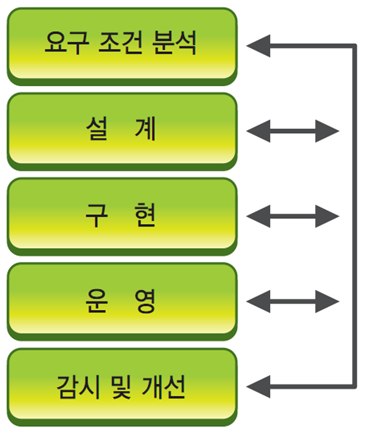
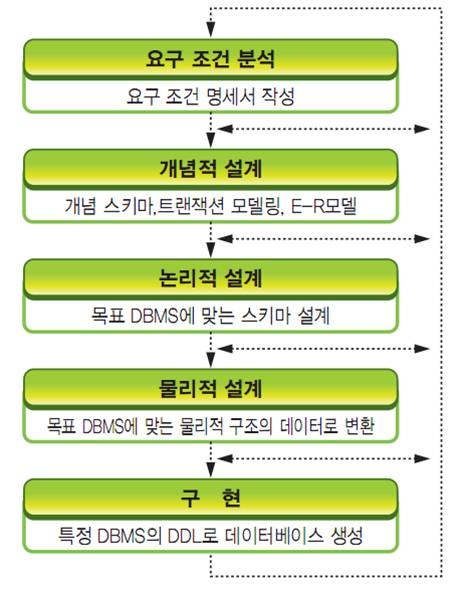

# 데이터베이스 설계의 개념

## 데이터 베이스 설계란?
- 데이터 베이스의 구조를 개발하는 과정 
#

## 데이터베이스 생명주기 

### 1. 요구 조건 분석 단계 
해당 엄무에 대한 분석과 함께 현재 시스템의 운영 상태등을 분석을 하고 사용자들의 요구사항에 대한 분석까지 포함하는 단계이다. 
#

### 2. 설계 단계 
설계 단계에서는 프로세스 설계와 데이터 중심 설계 두가지를 병행해야 한다.
#

### 3. 구현 단계 
데이터베이스가 구축되며 실질적인 프로그램 개발 작업에 들어가는 단계이다. 
#

### 4. 운영 단계 
실제로 운영을 하는 단계이다.
#

### 5. 감시와 개선 단계 
데이터베이스 시스템을 운영하면서 발생하는 새로운 조건이나 성능 개선을 위한 지속적 감시를 하는 단계이다.
#

## 데이터베이스 설계 단계 

### 1. 요구 조건 분석 
사용자가 원하는 데이터베이스의 용도를 파악하는 단계이다.
#

### 2. 개념적 설계 
사용자들의 요구 사항을 쉽게 기술하는 단계이다. 
#

### 3. 논리적 설계 
스키마를 설계하는 단계이며 이 단계에서는 트랜잭션 인터페이스를 설계하고 정규화 과정을 거치는 단계이다. 
#

### 4. 물리적 설계 
데이터베이스의 물리적 구조와 접근 방법 등을 설계하는 단계이다.
#

### 5. 구현 
목적 DBMS의 DDL로 기술된 명령어를 실행하여 데이터베이스를 생성한는 단계이다.
#
### 이러한 절차는 꼭 한방향으로 진행이 되는것이 아니다. 중간에 변경이 필요하다면 앞 단계로 돌아가 변경을 해도 된다. 
